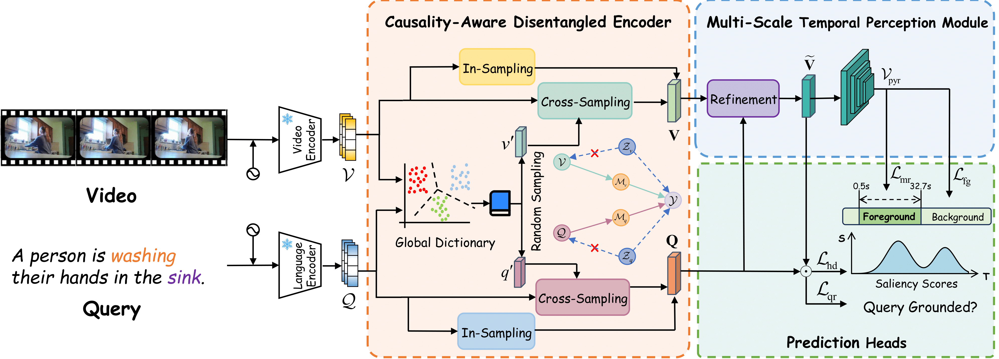

# CausalVTG: Towards Robust Video Temporal Grounding via Causal Inference

[](https://neurips.cc/virtual/2025/loc/san-diego/poster/116019)
[](https://huggingface.co/datasets/MXwanghhh/CausalVTG)
[](LICENSE)

<p align="center"></p>

## 📑 Table of Contents

- [Overview](#overview)
- [Installation](#installation)
- [Dataset](#dataset)
- [Training](#training)
- [Evaluation](#evaluation)
- [Model Zoo](#model-zoo)
- [Citation](#citation)
- [Acknowledgement](#acknowledgement)

## <a id="overview"></a>📝 Overview

Official implementation of **CausalVTG: Towards Robust Video Temporal Grounding via Causal Inference** (NeurIPS 2025).

## <a id="installation"></a>⚙️ Installation

**Environment:**
- Python 3.12
- PyTorch 2.2.1
- NNCore 0.4.4

```bash
git clone https://github.com/MxLearner/CausalVTG.git
cd CausalVTG
conda create -n causalvtg python=3.12 -y
conda activate causalvtg 
pip install -r requirements.txt
```

## <a id="dataset"></a>📂 Dataset

**Feature Downloads:**
- CLIP & SlowFast: [Lighthouse](https://github.com/line/lighthouse?tab=readme-ov-file#datasets-1)
- InternVideo2 (Charades-STA): [Video](https://huggingface.co/datasets/cg1177/charade_sta_internvideo2_videoclip_6b_w1s) | [Text](https://huggingface.co/datasets/cg1177/charade_sta_internvideo2_llama_text_feature)
- InternVideo2 (QVHighlight): [Video](https://huggingface.co/datasets/cg1177/qvhighlight_internvideo2_videoclip_6b_w2s) | [Text](https://huggingface.co/datasets/cg1177/qvhighlight_internvideo2_llama_text_feature)

> **Note:** Labels are provided in `data/`. Pre-extracted features (Charades-STA, QVHighlight and ActivityNet) and K-means cluster files are available via [Hugging Face](https://huggingface.co/datasets/MXwanghhh/CausalVTG/tree/main) for reproducibility.

<details>
<summary><b>Directory Structure</b></summary>

```
features/
├── ActivityNet/
│   ├── clip/
│   ├── clip_text/
│   ├── slowfast/
│   ├── internvideo2_llama_text_feature_activitynet/
│   ├── internvideo2_w2s_activitynet/
│   └── cluster_*.npz
├── Charades/
│   ├── clip/
│   ├── clip_text/
│   ├── slowfast/
│   ├── internvideo2_llama_text_feature/
│   ├── internvideo2_videoclip_6b_w1s/
│   └── cluster_*.npz
└── QVHighlight/
    ├── clip/
    ├── clip_text/
    ├── slowfast/
    ├── internvideo2_llama_text_feature/
    ├── internvideo2_videoclip_6b_w2s/
    └── cluster_*.npz
```

</details>

## <a id="training"></a>🚀 Training

### **Step 1: Build Global Dictionary** (skip if resuming from checkpoint)

```bash
python tools/extract_kmeans.py --folder <feat_dir> --target_file <output.npz> \
    --n_clusters 256 --file_type <npz|pt> [--array_key <key>]
```

<details>
<summary><b>Arguments</b></summary>

| Argument | Description | Required |
|----------|-------------|----------|
| `--folder` | Feature directory path | ✓ |
| `--target_file` | Output cluster file path | ✓ |
| `--n_clusters` | Number of clusters (default: 256) | ✓ |
| `--file_type` | `npz` or `pt` (default: `npz`) | |
| `--array_key` | Array key in npz file | ✓ (npz only) |
| `--kmeans_file` | Path to save/load KMeans model | |
| `--seed` | Random seed (default: 42) | |

**Feature-specific `--array_key`:**

| Feature Type | `--file_type` | `--array_key` |
|--------------|---------------|---------------|
| CLIP Text | `npz` | `last_hidden_state` |
| CLIP Visual / SlowFast | `npz` | `features` |
| InternVideo2 | `pt` | — |

</details>

### **Step 2: Launch Training**

```bash
python tools/launch.py --config <path-to-config>
```

<details>
<summary><b>Arguments</b></summary>

| Argument | Description |
|----------|-------------|
| `--config` | Path to config file |
| `--checkpoint` | Checkpoint to load |
| `--resume` | Checkpoint to resume from |
| `--work_dir` | Working directory |
| `--eval` | Evaluation only |
| `--dump` | Dump inference outputs |
| `--seed` | Random seed |
| `--amp` | Enable mixed precision training |
| `--debug` | Debug mode (NaN detection) |

</details>

## <a id="evaluation"></a>📊 Evaluation

```bash
python tools/launch.py <path-to-config> --checkpoint <path-to-checkpoint> --eval
```

For QVHighlights submission:

```bash
python tools/launch.py <path-to-config> --checkpoint <path-to-checkpoint> --dump
```

Submit `hl_{val,test}_submission.jsonl` to [CodaLab](https://codalab.lisn.upsaclay.fr/competitions/6937).

## <a id="model-zoo"></a>🗃️ Model Zoo

### Standard Benchmarks

<table>
  <tr>
    <th>Dataset</th>
    <th>Feature</th>
    <th>R1@0.3</th>
    <th>R1@0.5</th>
    <th>R1@0.7</th>
    <th>mAP</th>
    <th>HD mAP</th>
    <th>Download</th>
  </tr>
  <tr>
    <td rowspan="2">QVHighlights</td>
    <td>InternVideo2</td>
    <td>82.32</td>
    <td>70.97</td>
    <td>56.65</td>
    <td>51.04</td>
    <td>41.36</td>
    <td><a href="https://huggingface.co/datasets/MXwanghhh/CausalVTG/resolve/main/work_dirs/qvhighlights_internvideo_3/epoch_37.pth">model</a> | <a href="https://huggingface.co/datasets/MXwanghhh/CausalVTG/resolve/main/work_dirs/qvhighlights_internvideo_3/20251204064103.log">log</a></td>
  </tr>
  <tr>
    <td>CLIP+Slowfast</td>
    <td>77.03</td>
    <td>66.06</td>
    <td>51.42</td>
    <td>47.40</td>
    <td>39.60</td>
    <td><a href="https://huggingface.co/datasets/MXwanghhh/CausalVTG/resolve/main/work_dirs/qvhighlights_clip_22/epoch_35.pth">model</a> | <a href="https://huggingface.co/datasets/MXwanghhh/CausalVTG/resolve/main/work_dirs/qvhighlights_clip_22/20251208144942.log">log</a></td>
  </tr>
  <tr>
    <td rowspan="2">Charades-STA</td>
    <td>InternVideo2</td>
    <td>81.26</td>
    <td>71.88</td>
    <td>51.67</td>
    <td>50.84</td>
    <td>—</td>
    <td><a href="https://huggingface.co/datasets/MXwanghhh/CausalVTG/resolve/main/work_dirs/charades_internvideo_20/epoch_31.pth">model</a> | <a href="https://huggingface.co/datasets/MXwanghhh/CausalVTG/resolve/main/work_dirs/charades_internvideo_20/20251208144954.log">log</a></td>
  </tr>
  <tr>
    <td>CLIP+Slowfast</td>
    <td>71.48</td>
    <td>59.60</td>
    <td>40.30</td>
    <td>43.25</td>
    <td>—</td>
    <td><a href="https://huggingface.co/datasets/MXwanghhh/CausalVTG/resolve/main/work_dirs/charades_clip_20/epoch_25.pth">model</a> | <a href="https://huggingface.co/datasets/MXwanghhh/CausalVTG/resolve/main/work_dirs/charades_clip_20/20251208145005.log">log</a></td>
  </tr>
  <tr>
    <td>ActivityNet</td>
    <td>InternVideo2</td>
    <td>66.96</td>
    <td>49.07</td>
    <td>30.02</td>
    <td>37.98</td>
    <td>—</td>
    <td><a href="https://huggingface.co/datasets/MXwanghhh/CausalVTG/resolve/main/work_dirs/activitynet_internvideo_20/epoch_33.pth">model</a> | <a href="https://huggingface.co/datasets/MXwanghhh/CausalVTG/resolve/main/work_dirs/activitynet_internvideo_20/20251208152828.log">log</a></td>
  </tr>
</table>

### Robustness Evaluation (with Unanswerable Queries)

<table>
  <tr>
    <th>Dataset</th>
    <th>Feature</th>
    <th>R1@0.3</th>
    <th>R1@0.5</th>
    <th>R1@0.7</th>
    <th>mIoU</th>
    <th>Acc</th>
    <th>Download</th>
  </tr>
  <tr>
    <td rowspan="2">Charades-STA-RF</td>
    <td>InternVideo2</td>
    <td>76.41</td>
    <td>72.73</td>
    <td>63.13</td>
    <td>68.07</td>
    <td>82.98</td>
    <td><a href="https://huggingface.co/datasets/MXwanghhh/CausalVTG/resolve/main/work_dirs/charades_rf_internvideo_21/epoch_48.pth">model</a> | <a href="https://huggingface.co/datasets/MXwanghhh/CausalVTG/resolve/main/work_dirs/charades_rf_internvideo_21/20251208145019.log">log</a></td>
  </tr>
  <tr>
    <td>CLIP+Slowfast</td>
    <td>64.21</td>
    <td>60.97</td>
    <td>56.07</td>
    <td>58.96</td>
    <td>69.09</td>
    <td><a href="https://huggingface.co/datasets/MXwanghhh/CausalVTG/resolve/main/work_dirs/charades_rf_clip_21/epoch_44.pth">model</a> | <a href="https://huggingface.co/datasets/MXwanghhh/CausalVTG/resolve/main/work_dirs/charades_rf_clip_21/20251208145057.log">log</a></td>
  </tr>
  <tr>
    <td>ActivityNet-RF</td>
    <td>InternVideo2</td>
    <td>74.51</td>
    <td>65.45</td>
    <td>56.84</td>
    <td>65.74</td>
    <td>90.06</td>
    <td><a href="https://huggingface.co/datasets/MXwanghhh/CausalVTG/resolve/main/work_dirs/activitynet_rf_internvideo_9/epoch_31.pth">model</a> | <a href="https://huggingface.co/datasets/MXwanghhh/CausalVTG/resolve/main/work_dirs/activitynet_rf_internvideo_9/20251208204805.log">log</a></td>
  </tr>
</table>

## <a id="citation"></a>📌 Citation

```bibtex
@inproceedings{wangcausalvtg,
  title={CausalVTG: Towards Robust Video Temporal Grounding via Causal Inference},
  author={Wang, Qiyi and Chen, Senda and Shen, Ying},
  booktitle={The Thirty-ninth Annual Conference on Neural Information Processing Systems}
}
```

## <a id="acknowledgement"></a>🙏 Acknowledgement

We thank the authors of the following projects:

- [UniVTG](https://github.com/showlab/UniVTG)
- [R2-Tuning](https://github.com/yeliudev/R2-Tuning/)
- [RaTSG](https://github.com/HuiGuanLab/RaTSG)
- [Lighthouse](https://github.com/line/lighthouse)
- [InternVideo](https://github.com/OpenGVLab/InternVideo)
